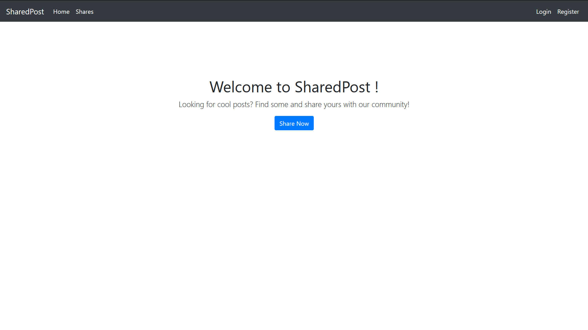
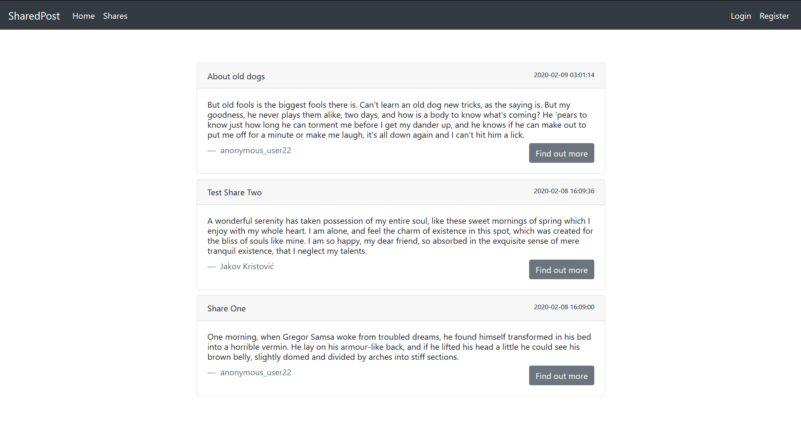
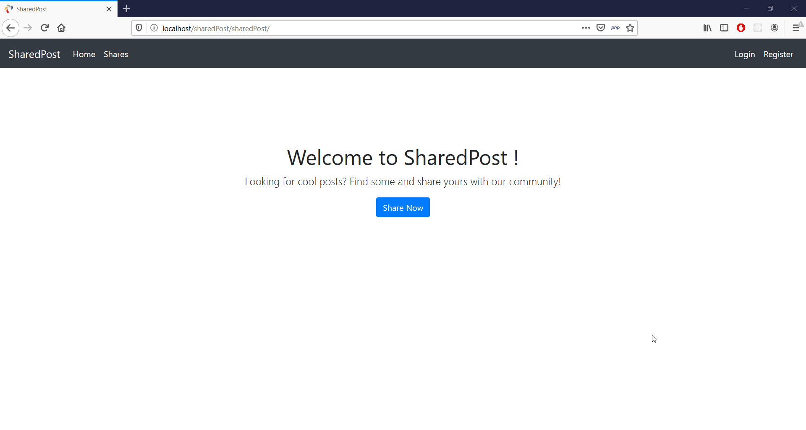
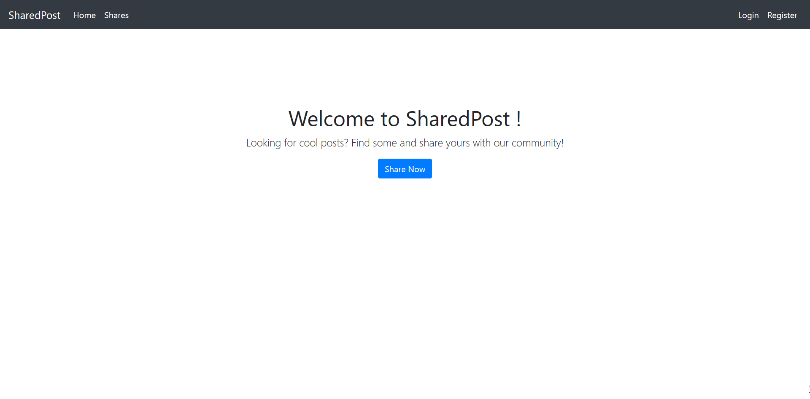
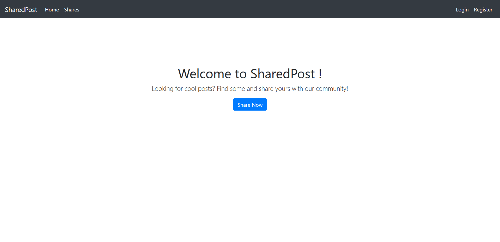
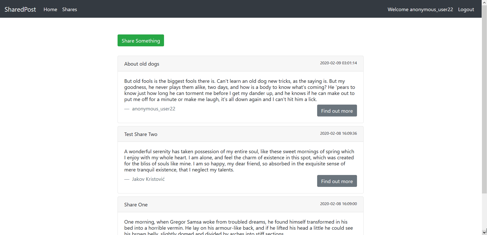
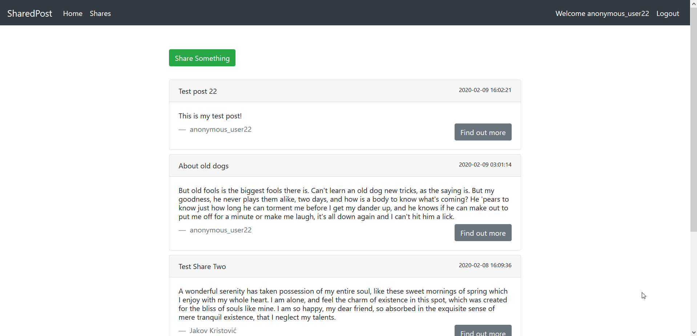

# sharedPost
 Simple social website project where users can share posts to community. This web application is made with purpose of practicing PHP and making apps in MVC architecture.
 
 ## 🚧 Functionalities so far
 
 ### As guest
 - Browsing shared posts
 - Registration
 - Login

### As registered user
 - Ability of sharing new post

## App preview (for HD image/gif preview - _Right click -> View image_)

#### Home page

#### Shares tab preview

### 💎 Here come the GIFs (Cool content ahead)

#### Browsing app as guest

#### Registration

#### Login

#### Sharing a new post

#### And finally logging out

### MVC architecture applied

### What tools have I used ? 

⚡ Well first, I've googled a lot. That seems to be an inevitably tool.

- Visual Studio Code (writing PHP + HTML + CSS)
- XAMPP for Windows 7.4.1
- phpMyAdmin @ localhost (MySql)
- Bootstrap v4.4

🚨 _* MD5 encryption is used for password storing purposes because of simplicity, switch to safer algorithm if you are going to use parts of this code in your applications._

### 🚀 How to run it 

In _Documentation_ folder in this repository, there is database SQL dump **_sharedposts.sql_** included.

1. **Host a local web server on your computer** with XAMPP or similar technology
2. **Create a database** of your choice (or just name it _sharesposts_) on phpMyAdmin
3. **Copy and execute** full content of **_sharedposts.sql_** in query
4. Tweak **_config.php_** file for database parameters (such as _DB_HOST_, _DB_USER_, etc.)
5. And run it writing **localhost/sharedPost/sharedPost/** in your browser _(because of additional GitHub folder ...)_

